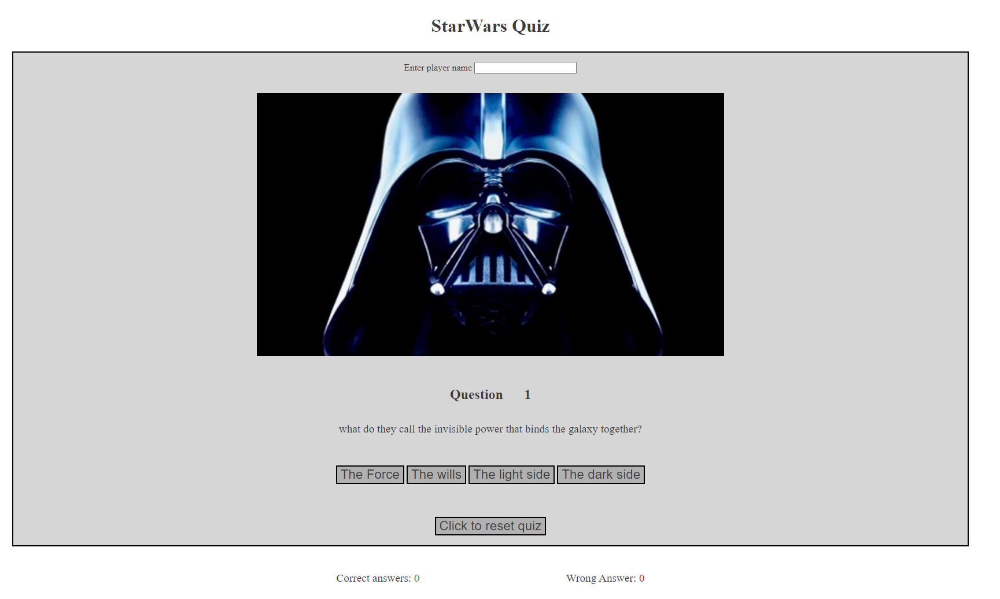
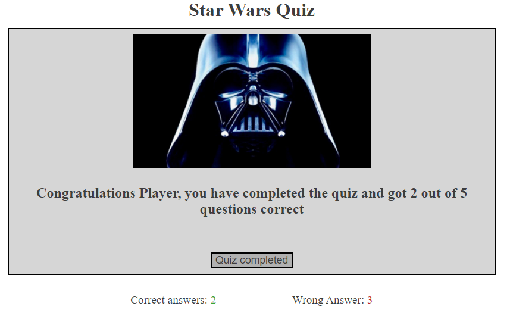

# Star wars quiz

This quiz is designed to test users knowledge of the star wars franchise, it does this by asking a number of questions that the user must answer to move forward, once the final question has been asked it will provide you with your score.

## User Stories

- __Stories__

    - I want to test my knowledge of star wars
    - I want to interact with the quiz
    - I want feedback if i got the question correct or wrong
    - I want to know my final score
    - I want to play again

## Features

- __Main Page__

    - Heading
    - User input field
        - User can enter a name that will then appear when the quiz is completed
    - Image that matches the quiz
    - Question number
        - Shows what question the user is on
    - Current question
        - Displays the current question
    - Answer boxes
        - Displays 4 question boxes, 3 wrong answers and 1 correct answer, boxes can be clicked to move to the next question
    - Reset button
        - this can be clicked at any point in the game to reset to question 1 and reset the score
    - Current score(correct/wrong answers)

- __Main Page Completed__

    - Heading
    - User input field
    - Image that matches the quiz
    - Text to confirm players name and the score
        - Displays the users name and congratulations, as well as your score out of question amount
    - Reset button
        - This can be clicked at any point in the game to reset to question 1 and reset the score
    - Current score(correct/wrong answers)

## Future Features

- More questions to answer, 20 - 30.
- Add a score board that will save each players name and update if its the same player
- Changing image to match/give hint to the play about the current question.

## Testing

The application/page has been tested on 3 validators for html, css and javascript. A media query has been created for mobile devices to stop the button selection from appearing on mouse over.

- Made sure that when a correct answer was selected it would always show as correct, and if a wrong answer was selected it would always show as wrong.
- Tested on PC, laptop and mobile phone(Samsung s20), also on chrome tools.
- Teststed on Chrome and Edge browsers.

- __Code__

    - HTML
        - Tested html code though [W3C validator](https://validator.w3.org)
        - Formatted code with GitPod
    - CSS
         - Tested css code though [Jigsaw](https://jigsaw.w3.org/css-validator)
         - Formatted code with GitPod
    - Javascript
         - Tested css code though [jshint](https://jshint.com/)
         - Formatted code with GitPod

- __Spellchecker__

    - [Online Spellchecker](https://www.online-spellcheck.com/)

- __Bugs / Issues__

    - Fixed
        - There was a bug on mobile when the button:hover was being used when clicked, the button would still have the hover effect when the new question was loaded, so when a button was clicked it was still selected for the next question.

    - Unfixed
        - No unfixed

__Accessibility__

## Deployment

- GitPod was used to create then using git add, commit and push to GitHub to deploy [Live version](https://seaniboy2009.github.io/Project2/).

- GitHub
    - Deployment was made from GitHub pages > settings > pages > select branch:main > save

- GitPod
    - Deployment was made from GitPod to GitHub > git add . > git commit -m > git push

## Credits

- __References__

- Media
    - Google.com / giantfreakinrobot.com - for darth vader image - https://www.giantfreakinrobot.com/ent/darth-vader-tv-series.html

- Text/Information
    - questions from - https://bigquizthing.com/blog-post/star-wars-trivia-questions-for-fun-game-night/

- Starwars - George lucas