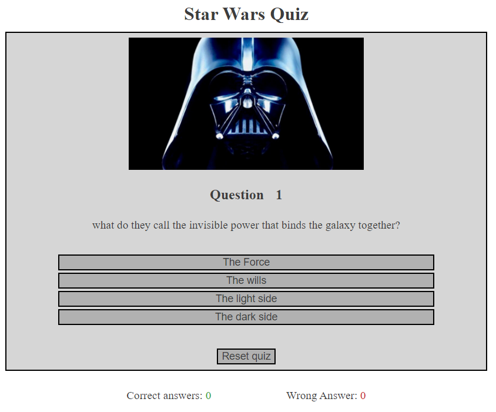

# Star wars quiz

## User Stories

- __Stories__

    - I want to test my knowledge of star wars
    - I want to interact with the quiz
    - I want feedback if i got the question correct or wrong
    - I want to know my final score
    - I want to play again

## Features

- __main page__

    - Heading
    - User input field
        - User can enter a name that will then appear when the quiz is completed
    - Image that matches the quiz
    - Question number
        - Shows what question the user is on
    - Current question
        - Displays the current question
    - Answer boxes
        - Displays 4 question boxes, 3 wrong answers and 1 correct answer, boxes can be clicked to move to the next question
    - Reset button
        - this can be clicked at any point in the game to reset to question 1 and reset the score
    - Current score(correct/wrong answers)

- __main page completed__

    - Heading
    - user input field
    - image that matches the quiz
    - text to confirm players name and the score
        - Displays the users name and congratulations, as well as your score out of question amount
    - reset button
        - this can be clicked at any point in the game to reset to question 1 and reset the score
    - current score(correct/wrong answers)

## Testing

The application/page has been tested on 3 validators for html, css and javascript. A media query has been crertaed for mobile devices to stop the button selection form appearing on mouse over, this was appearing on clicking it and would stay when the next question was generated.

- __Code__
    - HTML
        - Tested html code though [W3C validator](https://validator.w3.org)
        - Formatted code with GitPod
    - CSS
         - Tested css code though [Jigsaw](https://jigsaw.w3.org/css-validator)
         - Formatted code with GitPod
    - Javascript
         - Tested css code though [jshint](https://jshint.com/)
         - Formatted code with GitPod

- __Bugs / Issues__

    - there was a bug on mobile when the :hover was being used when clicked, the button would still have the hover effect when the new question was loaded

    - Spell checking
    - [Online Spellchecker](https://www.online-spellcheck.com/)

- Lighthouse accessibility, the accessibility is not 100% because there is no text for the social icons, But there is not supposed to be otherwise this score would be 100%

## Deployment

GitPod was used to create then using git add, commit and push to GitHub to deploy [Live version](https://seaniboy2009.github.io/Project2/).

 - Deployment was made from GitHub pages > settings > pages > select branch:main > save

## Credits

- __References__

- media
    - Google.com - for darth vader image - https://www.giantfreakinrobot.com/ent/darth-vader-tv-series.html

- Text/Information
    - questions from - https://bigquizthing.com/blog-post/star-wars-trivia-questions-for-fun-game-night/